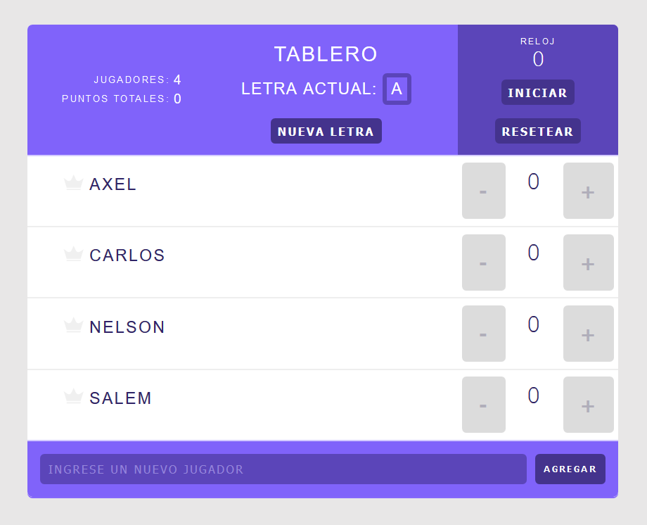

# Tutti Frutti - Tablero de puntos
Un simple contador de puntuación hecho con React.

[Probalo!](https://adperossa.github.io/tuttifrutti/)

## Descripción
Este proyecto era una de las sugerencias del curso de React de TeamTreehouse. Basado en una muestra del producto final con las funcionalidades que debía tener, fui armando el código y al final al presentarlo chequeé que mi enfoque fuera el correcto.

Tiene la funcionalidad de agregar y quitar participantes, marcar los ganadores dinámicamente y mantener un contador del tiempo para cada turno.

Las mejoras que se me ocurrieron y le introduje fue el selector al azar de una letra para hacerlo aplicable a un juego de Tutti Frutti, y el uso de la API Context para evitar el prop drilling. Se uso **React 12.4** por lo que no utilizo Hooks sino componentes de clase.

El objetivo era utilizar buenas prácticas poniendo en práctica conceptos como composición de clases, el flujo unidireccional de los datos característico de React, la abstracción del state a componentes superiores en la jerarquía y el uso de métodos de ciclo de vida. Según el profesor superó las expectativas :)

## TODO
Agregar validación para no ingresar un usuario sin nombre, y mantener al menos a un usuario siempre visible en el tablero, evitando que se borre a todos.